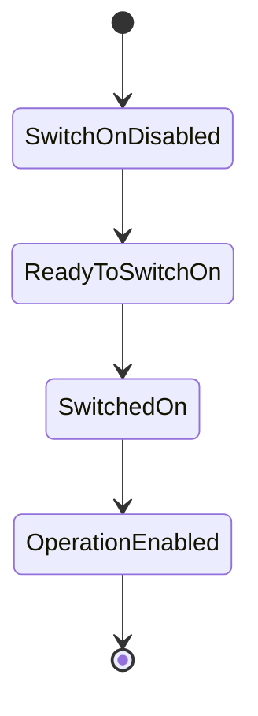

# EtherCAT Tutorial: Using ethercat_driver_ros2 with CIA 402 Drives

This tutorial provides a comprehensive guide to using the `ethercat_driver_ros2` stack to integrate EtherCAT-based CIA 402 drives with ROS 2 and ros2_control.

!!! info "What You'll Learn"
    - How to install and configure ethercat_driver_ros2
    - Understanding CIA 402 drive protocol and state machine
    - Configuring EtherCAT slaves with YAML files
    - Integrating drives into URDF with ros2_control
    - Controlling real EtherCAT hardware

## Introduction

### What is ethercat_driver_ros2?

The `ethercat_driver_ros2` stack provides a bridge between EtherCAT devices and ROS 2's ros2_control framework. It enables:

- **Real-time communication** with EtherCAT modules
- **Generic plugin architecture** for different device types
- **Seamless integration** with ros2_control Hardware Interfaces
- **Support for CIA 402 compliant motor drives**

!!! tip "Resources"
    - **Repository**: [ICube-Robotics/ethercat_driver_ros2](https://github.com/ICube-Robotics/ethercat_driver_ros2/tree/jazzy)
    - **Documentation**: [https://icube-robotics.github.io/ethercat_driver_ros2/](https://icube-robotics.github.io/ethercat_driver_ros2/)

### What is CIA 402?

CIA 402 (CANopen device profile for drives and motion control) is a standardized protocol for controlling motor drives. The `EcCiA402Drive` plugin implements this standard for EtherCAT-based drives, providing:

- **Automatic state machine management** (Switched On, Operation Enabled, etc.)
- **Multiple modes of operation**: Position (8), Velocity (9), Effort/Torque (10), Homing (6)
- **Fault handling** with automatic or manual reset
- **Safe default behavior** to prevent unwanted movements

## Prerequisites

### System Requirements

- **ROS 2** (Jazzy or compatible distribution)
- **Linux with PREEMPT_RT kernel** (recommended for real-time performance)
- **IgH EtherCAT Master** installed and configured
- **Root privileges** or proper user permissions for EtherCAT access

### Knowledge Requirements

- Basic understanding of ROS 2 and ros2_control
- Familiarity with URDF and YAML configuration files
- Understanding of EtherCAT concepts (PDO, SDO, etc.)

## Installation

### 1. Install IgH EtherCAT Master

First, install the IgH EtherCAT Master:

```bash
# Clone the repository
git clone https://gitlab.com/etherlab.org/ethercat.git
cd ethercat

# Configure and build
./bootstrap
./configure --prefix=/opt/etherlab --disable-8139too --enable-generic
make
sudo make install

# Configure the system
sudo ln -s /opt/etherlab/etc/init.d/ethercat /etc/init.d/ethercat
sudo mkdir -p /etc/sysconfig
sudo cp /opt/etherlab/etc/sysconfig/ethercat /etc/sysconfig/
```

Edit `/etc/sysconfig/ethercat` to configure your network interface:

```bash
sudo nano /etc/sysconfig/ethercat
```

Set the `MASTER0_DEVICE` to your Ethernet MAC address.

### 2. Install ethercat_driver_ros2

Create a ROS 2 workspace and clone the repository:

```bash
# Create workspace
mkdir -p ~/ros2_ethercat_ws/src
cd ~/ros2_ethercat_ws/src

# Clone the repository (jazzy branch)
git clone -b jazzy https://github.com/ICube-Robotics/ethercat_driver_ros2.git

# Install dependencies
cd ~/ros2_ethercat_ws
rosdep install --from-paths src --ignore-src -r -y

# Build the workspace
colcon build --cmake-args -DCMAKE_BUILD_TYPE=Release

# Source the workspace
source install/setup.bash
```

### 3. Configure User Permissions

Add your user to the ethercat group:

```bash
sudo usermod -a -G ethercat $USER
```

!!! warning
    Log out and log back in for the changes to take effect.

## Understanding CIA 402 Drives

### State Machine

CIA 402 drives follow a standardized state machine:



The `EcCiA402Drive` plugin automatically manages these transitions, bringing the drive to `OPERATION_ENABLED` state by default.

### Modes of Operation

| Mode | Value | Description |
|------|-------|-------------|
| **Cyclic Sync Position** | 8 | Real-time position control (most common) |
| **Cyclic Sync Velocity** | 9 | Real-time velocity control |
| **Cyclic Sync Torque** | 10 | Real-time torque control |
| **Homing** | 6 | Automatic homing procedure |

## Configuration

### Step 1: Create a Slave Configuration File

Create a YAML file to configure your EtherCAT drive. Example for Maxon EPOS3:

```yaml title="config/maxon_epos3.yaml"
# Configuration file for Maxon EPOS3 drive
vendor_id: 0x000000fb
product_id: 0x64400000
assign_activate: 0x0300  # DC Synch register
auto_fault_reset: false  # Manual fault reset

# SDO configuration at startup
sdo:
  - {index: 0x60C2, sub_index: 1, type: int8, value: 10}  # Interpolation time: 10 ms
  - {index: 0x60C2, sub_index: 2, type: int8, value: -3}  # Time base: 10^-3s

# RxPDO Mapping (Master → Slave)
rpdo:
  - index: 0x1603
    channels:
      - {index: 0x6040, sub_index: 0, type: uint16, default: 0}  # Control word
      - {index: 0x607a, sub_index: 0, type: int32, command_interface: position, default: .nan}
      - {index: 0x60ff, sub_index: 0, type: int32, default: 0}  # Target velocity
      - {index: 0x6071, sub_index: 0, type: int16, default: 0}  # Target torque
      - {index: 0x6060, sub_index: 0, type: int8, default: 8}   # Mode: Cyclic Sync Position

# TxPDO Mapping (Slave → Master)
tpdo:
  - index: 0x1a03
    channels:
      - {index: 0x6041, sub_index: 0, type: uint16}  # Status word
      - {index: 0x6064, sub_index: 0, type: int32, state_interface: position}
      - {index: 0x606c, sub_index: 0, type: int32, state_interface: velocity}
      - {index: 0x6077, sub_index: 0, type: int16, state_interface: effort}
      - {index: 0x6061, sub_index: 0, type: int8}    # Mode display
```

### Key Configuration Elements

#### vendor_id and product_id

Find these using:

```bash
ethercat slaves
```

#### PDO Mapping

**RxPDO (Master → Slave)**: Commands sent to the drive

- `command_interface`: Maps to ros2_control command interfaces
- `default`: Default value when not actively controlled

**TxPDO (Slave → Master)**: Feedback from the drive

- `state_interface`: Maps to ros2_control state interfaces

## URDF Integration

### Basic Configuration

Integrate the EtherCAT drive into your robot's URDF:

```xml title="ros2_control/robot.ros2_control.urdf"
<?xml version="1.0"?>
<robot xmlns:xacro="http://www.ros.org/wiki/xacro" name="my_robot">

  <ros2_control name="ethercat_system" type="system">
    <hardware>
      <plugin>ethercat_driver/EthercatDriver</plugin>
      <param name="master_id">0</param>
      <param name="control_frequency">100</param>
    </hardware>

    <!-- Joint configuration -->
    <joint name="joint_1">
      <state_interface name="position"/>
      <state_interface name="velocity"/>
      <state_interface name="effort"/>
      <command_interface name="position"/>
      <command_interface name="reset_fault"/>
      
      <ec_module name="Joint1_Drive">
        <plugin>ethercat_generic_plugins/EcCiA402Drive</plugin>
        <param name="alias">0</param>
        <param name="position">0</param>
        <param name="mode_of_operation">8</param>
        <param name="slave_config">/path/to/maxon_epos3.yaml</param>
      </ec_module>
    </joint>

  </ros2_control>

</robot>
```

### Multi-Joint Configuration

For robots with multiple joints, add more joint definitions with incremented positions:

```xml
<joint name="joint_2">
  <!-- ... interfaces ... -->
  <ec_module name="Joint2_Drive">
    <plugin>ethercat_generic_plugins/EcCiA402Drive</plugin>
    <param name="alias">0</param>
    <param name="position">1</param>  <!-- Next position on bus -->
    <param name="mode_of_operation">8</param>
    <param name="slave_config">/path/to/drive_config.yaml</param>
  </ec_module>
</joint>
```

## Launch and Usage

### Start EtherCAT Master

```bash
sudo systemctl start ethercat
```

Verify slaves are detected:

```bash
ethercat slaves
```

Expected output:
```
0  0:0  PREOP  +  MAXON EPOS3 70/10 EtherCAT
```

### Launch Your Robot

Create a launch file similar to the SCARA tutorial, but ensure you run with real-time priority:

```python
control_node = Node(
    package="controller_manager",
    executable="ros2_control_node",
    parameters=[robot_description, robot_controllers],
    output="both",
    # Run with real-time priority
    prefix=['sudo -E env "PATH=$PATH" chrt -f 95'],
)
```

Launch your robot:

```bash
ros2 launch my_robot_bringup robot_ethercat.launch.py
```

### Send Commands

Use standard ros2_control interfaces to command your robot:

```bash
# Check controller status
ros2 control list_controllers

# Send position command
ros2 topic pub /joint_trajectory_controller/joint_trajectory \
  trajectory_msgs/msg/JointTrajectory \
  "{joint_names: ['joint_1'], points: [{positions: [0.5], time_from_start: {sec: 2}}]}" \
  --once
```

## Advanced Topics

### Fault Handling

#### Manual Fault Reset

When `auto_fault_reset: false`:

```bash
# Trigger fault reset via rising edge
ros2 service call /controller_manager/set_hardware_component_state \
  controller_manager_msgs/srv/SetHardwareComponentState \
  "{name: 'ethercat_system', target_state: {id: 3, label: 'active'}}"
```

### Mode Switching

Switch between position, velocity, and torque control dynamically by:

1. Defining multiple command interfaces in URDF
2. Using mode-switching controllers
3. Sending `NaN` to unused interfaces when switching

### Real-Time Performance

For optimal real-time performance:

1. **Install PREEMPT_RT kernel**
2. **Set real-time priorities** in launch file
3. **Optimize control frequency** (100-1000 Hz)
4. **Isolate CPU cores** for real-time tasks

## Troubleshooting

| Issue | Solution |
|-------|----------|
| Slave not detected | Check `ethercat config` and network interface |
| Permission denied | Add user to ethercat group: `sudo usermod -aG ethercat $USER` |
| Drive stays in fault | Check wiring, power, and config file |
| Position drift | Set `default: .nan` for target position in config |

## Next Steps

- Experiment with different control modes
- Optimize configuration for your hardware
- Explore the [developer guide](https://icube-robotics.github.io/ethercat_driver_ros2/developer_guide/new_plugin.html)

## Additional Resources

- [Generic EtherCAT Slave Configuration](https://icube-robotics.github.io/ethercat_driver_ros2/user_guide/config_generic_slave.html)
- [CANopen over EtherCAT](https://icube-robotics.github.io/ethercat_driver_ros2/developer_guide/coe.html)
- [API Reference](https://icube-robotics.github.io/ethercat_driver_ros2/api/)

---

Happy controlling! 🤖
